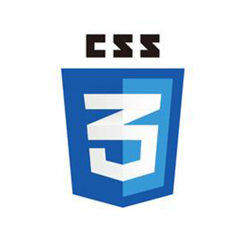
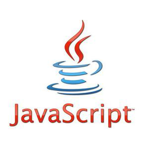

记录下我看《javascript高级程序设计（第三版）》的一些笔记，也顺便学习下Git和GitHub的相关操作撒。毕竟实践出真知！

   

# 四logo镇楼！

## 第一章 [JavaScript简介](./docs/chapter1.md)

JavaScript 是一种专为与网页交互而设计的脚本语言,由下列三个不同的部分组成:
* ECMAScript,由 ECMA-262 定义,提供核心语言功能;
* 文档对象模型(DOM),提供访问和操作网页内容的方法和接口;
* 浏览器对象模型(BOM),提供与浏览器交互的方法和接口。

